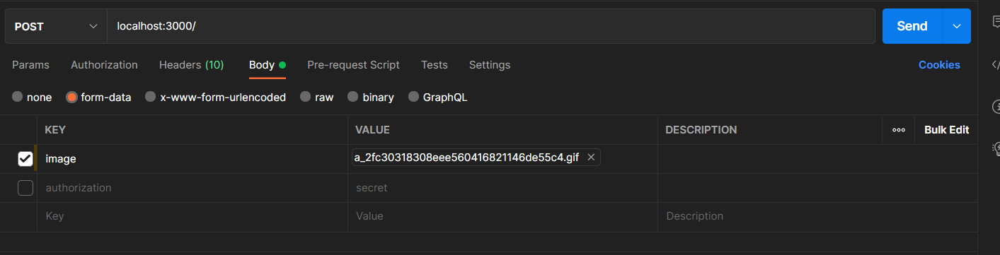

# A basic image server
### this tool lets you share images through a url with a custom embed
<br>
<br>

# how to setup 
to setup this tool you will have to have [NodeJS](https://nodejs.org) installed on your machine.
 
1. download the latest version of [NodeJS](https://nodejs.org)
2. install all the dependencies using the command: `npm install`
3. edit the file `config.json` and set the following values:

    ```json
    {
        "secret": "your secret key set this to anything secure", 
        "embedConfig": {
            "title": "title of the embed",
            "description": "description of the embed",
            "color": "hex color code"
        }, 
        "port": 3000
    }
    ```

4. run the server using the command: `node index.js`
<br>
<br>

# how to use it
To add a image to the server you will have to make a post request to the url: `http://localhost:3000/` with the header called `Authourization` set to the secret key you set in the config file. And then you will have to put the image in the body of the request. 

EX: 




To delete an image you will have to make a delete request to the url: `http://localhost:3000/ID-OF-IMAGE` with the header called `Authourization` set to the secret key you set in the config file.

<hr>

Made with ❤️by [@mini51](https://github.com/mini51)